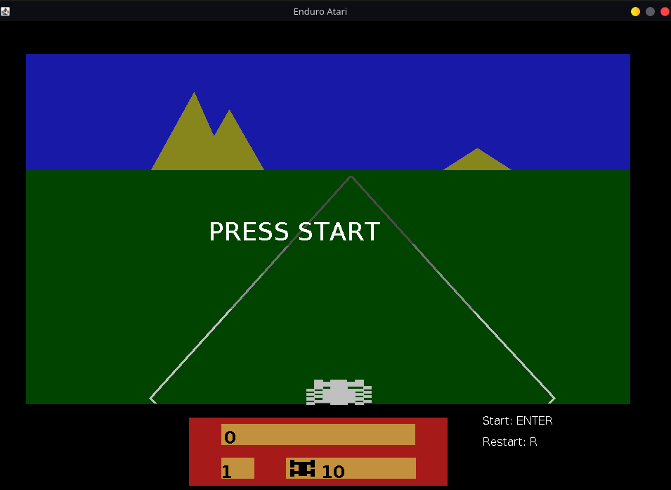

# Enduro Atari em Java

<h1 align="center">
  
</h1>

- Trabalho avaliativo para a disciplina de Programação Orientada a Objetos.
- Curso de Ciências da Computação na Universidade Federal de Jataí.
- <b>Ano de aplicação:</b> 2018.

## Descrição
Desenvolvimento da interface gráfica inspirada no jogo Enduro (1983) de Atari. As tarefas atribuídas foram as seguintes:
- Construir os elementos gráficos do cenário e animá-los (ex: carros, cenário, placar).
- Adaptar a jogabilidade conforme os elementos gráficos construídos;
